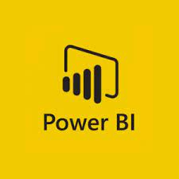
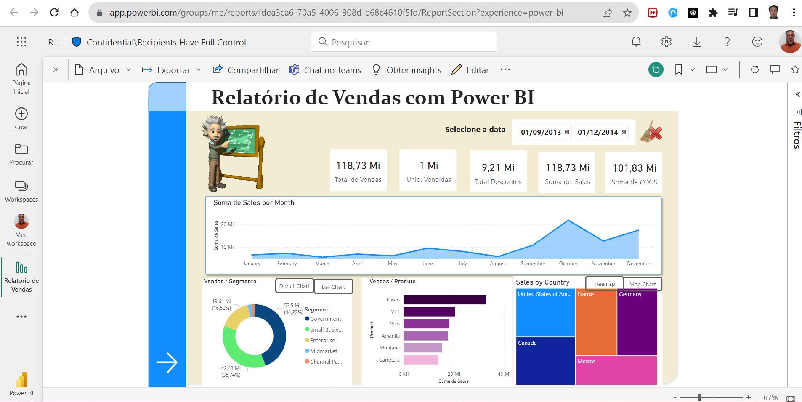
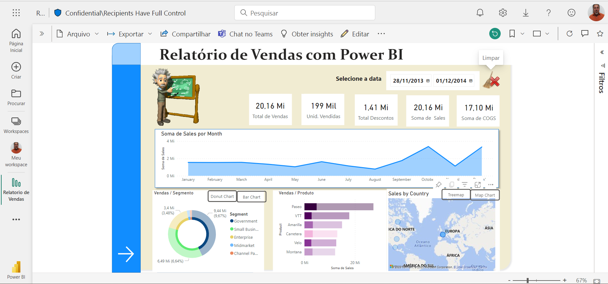
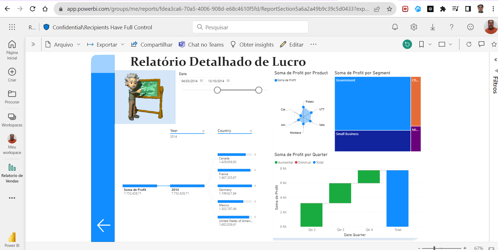

 

<H1>Sales Report with Power BI</H1>

Power BI - 2023

   
 
## Interactive report with Power BI
 
This repository contains a sales report project developed with Power BI. The report provides a comprehensive and interactive view of sales data, allowing for detailed analysis of sales performance metrics.
 
 
## Resources

- Dynamic and informative visualizations that show sales performance by products, regions and time periods.
- Intuitive charts that illustrate trends, variances and sales patterns.
- Custom calculated measures for deeper analysis, including changes from prior periods.
- Interactive dashboards that allow you to explore the data and extract specific insights.
- Integration with real-time data, providing updated and accurate information.
- User-friendly interface to easily browse and filter data.

## Technology
 
* Power BI Desktop
 
## Services used
 
* Power BI service
 
 
## How to use
 
1. Download the report's `.pbix` file and open it in Power BI Desktop.
2. Connect to your sales data or replace sample data with your own.
3. Explore visualizations, charts and dashboards to analyze sales performance.
4. Customize and adjust the report to your specific needs.
5. Share the report with colleagues or stakeholders for collaboration and informed decision making.

## Results
 

 
 
## Conclusion

This Power BI sales report is a valuable tool for sales performance analysis and data-driven decision making. Please feel free to explore, adapt and share this report to improve your understanding and optimization of sales operations.

## Links
 
   - Repository: https://github.com/vicssb/Relatorio-de-Vendas-com-Power-BI
     - In case of sensitive bugs such as security vulnerabilities, please contact
       directly instead of using the issue tracker. We value your effort
       to improve the security and privacy of this project!

 
## Versioning
 
1.0.0.0
 
 
## Author
 
* **Victor Sérgio Silva Barros**: 

- @vicssb (https://github.com/vicssb)
 

  

  

  

  
  

Please follow github and join us!
Thanks for visiting and happy coding!

